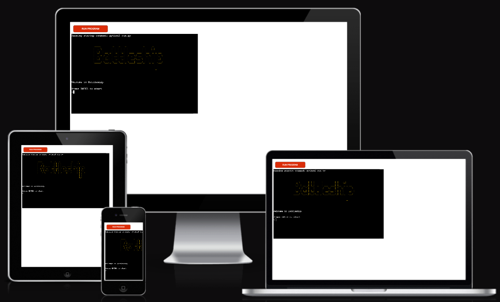

        B B B B        A      T T T T T  T T T T T  L          E E E E E    S S S S  H       H    I    P P P P
        B       B    A   A        T          T      L          E          S          H       H    I    P       P
        B       B  A       A      T          T      L          E          S          H       H    I    P       P
        B B B B    A A A A A      T          T      L          E E E        S S S    H H H H H    I    P P P P
        B       B  A       A      T          T      L          E                  S  H       H    I    P
        B       B  A       A      T          T      L          E                  S  H       H    I    P
        B B B B    A       A      T          T      L L L L L  E E E E E  S S S S    H       H    I    P

# Battleship Game

[View the live project here](https://battleship-rm.herokuapp.com/)

## Table of contents
1. [Introduction](#Introduction)
    1. [How To Play](#How-To-Play)
2. [UX](#UX)
    1. [Ideal User Demographic](#Ideal-User-Demographic)
    2. [User Stories](#User-Stories)
    3. [Development Planes](#Development-Planes)
    4. [Design](#Design)
3. [Features](#Features) 
    1. [Imagery](#Imagery)
    2. [Existing Features](#Existing-Features)
    3. [Features to Implement in the future](#Features-to-Implement-in-the-future)
4. [Issues and Bugs](#Issues-and-Bugs)
5. [Technologies Used](#Technologies-Used)
    1. [Main Languages Used](#Main-Languages-Used)
    3. [Frameworks, Libraries & Programs Used](#Frameworks,-Libraries-&-Programs-Used)
6. [Testing](#Testing)
    1. [Testing User Stories](#Testing-User-Stories)
    2. [Manual Testing](#Manual-Testing)
    3. [Automated Testing](#Automated-Testing) 
        - [Code Validation](#Code-Validation)
    4. [User Testing](#User-Testing)
7. [Deployment](#Deployment)
    1. [Deploying on GitHub Pages](#Deploying-on-GitHub-Pages)
8. [Credits](#Credits)
    1. [Content](#Content)
    2. [Media](#Media)
    3. [Code](#Code)
9. [Acknowledgements](#Acknowledgements)