# Battleship

[View the live project here](https://battleship-chrisf64-45141827d49d.herokuapp.com/)

## Table of contents
1. [Introduction](#Introduction)
    1. [How To Play](#How-To-Play)
2. [UX](#UX)
    1. [Ideal User Demographic](#Ideal-User-Demographic)
    2. [User Stories](#User-Stories)
    3. [Development Planes](#Development-Planes)
    4. [Design](#Design)
3. [Features](#Features) 
    1. [The Welcome Message](#The-Welcome-Message)
    2. [The Game](#The-Game)
4. [Issues and Bugs](#Issues-and-Bugs)
5. [Technologies Used](#Technologies-Used)
    1. [Main Languages Used](#Main-Languages-Used)
    3. [Frameworks, Libraries & Programs Used](#Frameworks,-Libraries-&-Programs-Used)
6. [Testing](#Testing)
    1. [Testing User Stories](#Testing-User-Stories)
    2. [Manual Testing](#Manual-Testing)
    3. [Automated Testing](#Automated-Testing) 
        - [Code Validation](#Code-Validation)
    4. [User Testing](#User-Testing)
7. [Deployment](#Deployment)
    1. [Deploying on GitHub Pages](#Deploying-on-GitHub-Pages)
8. [Credits](#Credits)
    1. [Content](#Content)
    2. [Media](#Media)
    3. [Code](#Code)
9. [Acknowledgements](#Acknowledgements)
***

## Introduction

For PP3 Python Essentials, the developer built a battleship game. Although similar to the original player versus computer battleship game, this one is played only by the player. The computer randomly places 10 ships on a 10 x 10 grid and the player has to target them with missiles. The objective is to destroy the computers fleet.

### How To Play

- When the game begins, the player is requested to enter their name and choose a difficulty.
- Depending on the chosen difficulty, the player will have 80, 70, 60 or 50 missiles to launch.
- The computer randomly places 10 ships on the play board, occupying 20 spaces.
- Ships will be placed horizontally or vertically, but not diagonally.
- The player enters coordinates and launches a missile.
- The game logs how many missiles have been used and how many remain.
- If the player destroys all enemy ships before using all missiles, the player wins.
- If the player uses all missiles and all enemy ships have not been destroyed, the player loses.
- The rules of the game can be accessed at any time by entering '?'.

[Back to top ⇧](#battleship)

## UX
### Ideal User Demographic
The ideal user for this website is:
* New user
* Current user

#### New User Goals
1. As a new user, I want to see the rules of the game and clear instructions for gameplay. 
2. As a new user, I want to see a visual representation of how many missiles I've launched and my remaining missiles.
3. As a new user, I want the ability to replay the game.

#### Current User
1. As a current user, I want the ability to replay the game.
2. As a current user, I want to guess and hit the various ships.
3. As a current user, I want see where the ships are at the end of the game. 

### Development-Planes
To create a command-line application that allows the user to play a classic game Battleships or Sea Battle is a strategy type guessing game for two players.

#### Strategy
Strategy incorporates user needs as well as product objectives. This website will focus on the following target audience, divided into three main categories:
- **Roles:**
    - New users
    - Current users

- **Demographic:**
    - All ages
    - All puzzle playing levels

- **Psychographic:**
    - Lifestyles:
        - Interest in games
        - Interest in strategy
        - Interest in puzzles
    - Personality/Attitudes:
        - Focused
        - Forward-Thinking
        - Creative
    
The application needs to enable the **user** to:
- play the game "Battleship" using alpha characters and numbers.
- generate a random board on each play-through placing ships in different locations.
    

#### Scope
Using the information in the strategy plane, the identified required features have been broken into the following two categories.
- Content Requirements:
    - The user will be looking for:
        - Clear and concise instructions.
        - A consistent theme, and game play. 
- Functionality Requirements:
    - The user will be able to:
        - Enter co-ordinates using numbers and letters.
        - Replay the game.
        - End the program at the end of the game.

#### Structure
The project will be deployed to a Heroku terminal, with no styling. 

#### Skeleton
A flowchart has been created to demonstrate the logic the functions will follow.

Flowchart

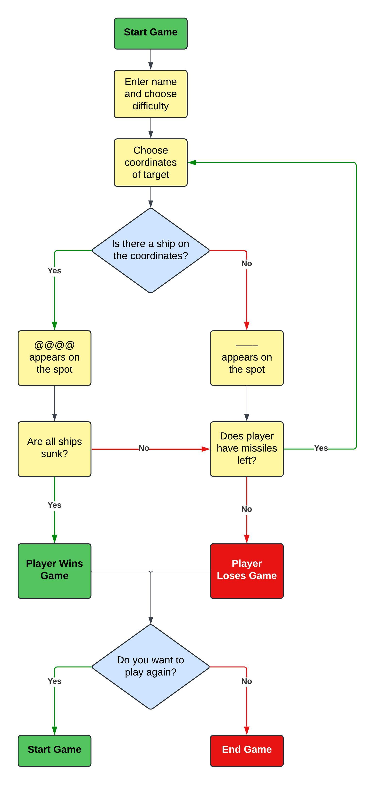

[Back to top ⇧](#battleship)

## Features

### The Welcome Message
- When a new game starts, the welcome message is displayed

  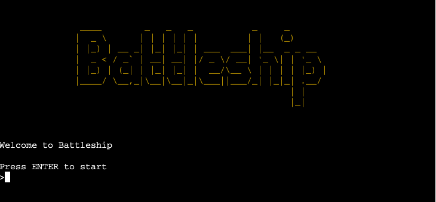

- The user is prompted to enter their name and asked if they are familiar with the rules

    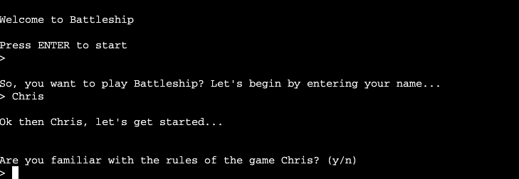

- If the user is not familiar with the rules, the rules are presented and the user is then asked to select a difficulty level

    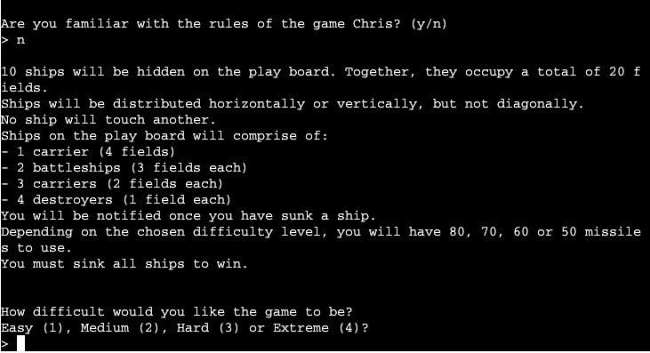

- The user is then prompted to press enter to set up the playing field

    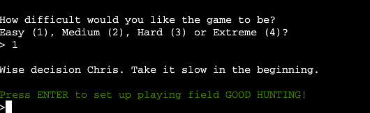

### The Game

- Once the board has been set up, the user is reminded that they can review the rules at any time by pressing '?' and is prompted to enter coordinates for first target

    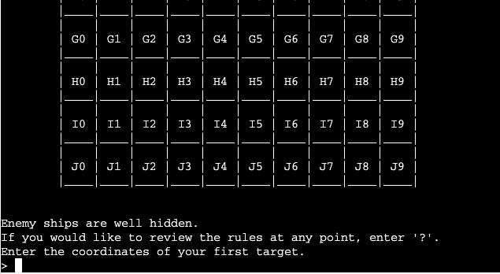

- Each field on the play board has a coordinate marked on it, e.g. 'H4'

- Ships that have been hit will show up as **@@@@** and fields that were targeted but no ships were hit will show up as **----**

- If the missile has successfully hit a ship, it is displayed in the terminal

    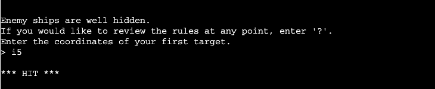

- Similarly, if a missle doesn't successfully hit a ship, it is displayed in the terminal

    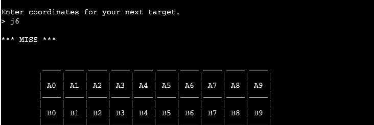

- Missile launch count and remaining missile count is displayed to the user, along with current amount of hits, and amount of hits remaining to win the game

    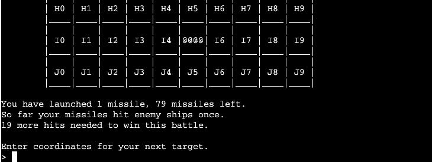

- When a ship has been completely destroyed, the user is notified of which ship has been sunk

    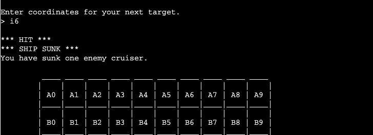

- If coordinates outside of the play board are chosen, the user will be notified

    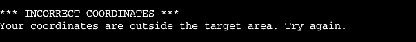

- If coordinates are chosen that have already been targeted, the user will be notified

    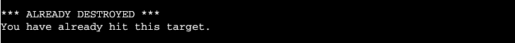

- If all ships are sunk, the user wins the game. However, if all missiles are used and ships still remain on the board, the user loses

    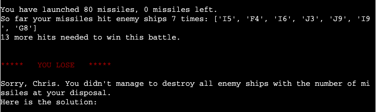

- When the game ends, the user is asked if they would like to play another round

    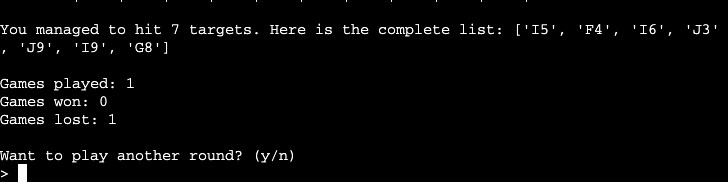

- If the user chooses yes, the game begins all over again. If the user chooses no, the game presents a farewell message

    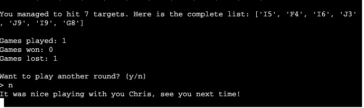

[Back to top ⇧](#battleship)

## Issues and Bugs 
Due to slow, meticulous structure and testing, the developer did not run into any bugs.

[Back to top ⇧](#battleship)

## Technologies Used
### Main Languages Used
- [Python](https://en.wikipedia.org/wiki/Python_(programming_language) "Link to Python Wiki")

### Frameworks, Libraries & Programs Used
- [GitPod](https://gitpod.io/ "Link to GitPod homepage")
    - GitPod was used for writing code, committing, and then pushing to GitHub.
- [GitHub](https://github.com/ "Link to GitHub")
    - GitHub was used to store the project after pushing.
- [Lucid](https://lucid.app/ "Link to Lucid homepage")
    - Lucid was used to create a flowchart of information, making the logic of the game easily understood.
- [Am I Responsive?](http://ami.responsivedesign.is/# "Link to Am I Responsive Homepage")
    - Am I Responsive was used to generate mock-up imagery of the terminal showing the game in use on Heroku.

[Back to top ⇧](#battleship)

## Testing

Testing has been implemented throughout the entire project mainly debugging through running the program in the terminal.
Sections of code were developed before implementation to make sure it worked and also where run through the PEP8 validator.
Tested in Gitpod terminal, Visual Studio terminal and CI Heroku terminal.

#### New User Goals:
1. As a new user, I want to see clear instructions for gameplay.
  - when the program is run, the user is asked if they are familiar with the rules of the game.
  
2. As a new user, I want to see a visual count of how many missiles I have remaining.
  - After each misile launch, a count of how many missiles the user has launched, and how many missiles there are remaining. .

3. As a new user, I want the ability to replay the game.
  - At the end of each game, regardless of the outcome, the user is given the option to enter 'y' to replay or 'n' to end the game.

#### Current User
1. As a current user, I want the ability to replay the game.
  - At the end of each game, regardless of the outcome, the user is given the option to enter 'y' to replay or 'n' to end the game.

2. As a current user, I want the game to be more challenging.
  - When the game launches and when replay is chosen, the user is presented with a choice of 4 difficulty levels - Easy, Medium, Hard or Extreme?.

[Back to top ⇧](#battleship)

## Manual Testing

### Common Elements Testing
Manual testing was conducted on the following elements that appear in the program:
     
- Due to the nature of the project, testing has been implemented throughout the entire project mainly debugging through running the program in the terminal.
- Sections of code where developed before implementation to make sure it worked and also where run through the Python validator.
- Tested in Gitpod terminal, Visual Studio Code terminal and CI Heroku terminal.
- Limit testing has been conducted by myself, friends, family, and work colleagues, and there are currently no reported issues that have caused the game to break.

[Back to top ⇧](#battleship)

## Automated Testing

### Code Validation
The [PEP8 Online Checker](https://extendsclass.com/python-tester.html) service was used to validate the code written in the run.py file.

**Results:**

run.py Validation results

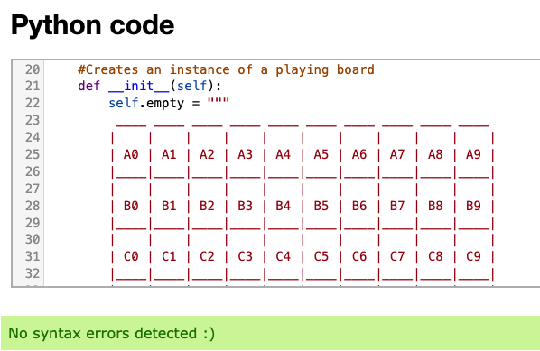

## User testing 

Tested by friends, family and work colleagues.

## Deployment

### Deploying on Heroku
To deploy this project to Heroku from its GitHub repository, the following steps were taken:

1. In your repository, type "pip freeze > requirements.txt" to create the list of dependencies to the requirements.txt file. Save, commit and push your changes to GitHub.

2. Create an account with [Heroku](https://www.heroku.com/ "Link to Heroku site"), selecting Python as the 'Primary development language'.

3. Go to your emails and click the link to verify your email address. The link will bring you to a page where you can create a password. Create a password and log in.

4. On the dashboard, click the 'create new app' button. Enter a unique name for your app and select your region. Click 'Create App'.

5. Go to the settings tab and click 'Reveal Config Vars'. Enter PORT as the KEY value and 8000 as the VALUE value.

6. Click 'Add Buildpack' and select 'Python' and 'Nodejs'. Python must be on the top of the list. Click and drag the buildpacks to the correct positions if needed.

7. Go to the deploy tab and, under 'Deployment method', click 'GitHub' and then 'Connect to GitHub'.

8. In 'Connect to GitHub', search for the repository you wish to use, then click 'Connect'.

9. If you 'Enable Automatic Deploys', Heroku will rebuild the app every time you push a change to GitHub. You can also choose to manually deploy using the 'Deploy Branch' option. Heroku will build the app and when it is finished, click the 'View' button to open the terminal.

## Credits 

The webpage [GitHub Docs - Fork a repo](https://docs.github.com/en/github-ae@latest/get-started/quickstart/fork-a-repo "Link to a GitHub Docs article on cloning and forking a repository") was used to get instructions on forking and cloning a repository. This information was used in the Deployment section of the README file.

### Code 
The developer consulted multiple sites to better understand the code they were trying to implement. The following sites were used on a more regular basis:
- [Stack Overflow](https://stackoverflow.com/ "Link to Stack Overflow page")
- [W3Schools](https://www.w3schools.com/ "Link to W3Schools page")
- [github](https://github.com/Becky139/Battleship "link to another students game")
- [Heroku](https://battleship-rm.herokuapp.com/ "Link to another students game on heroku")

[Back to top ⇧](#battleship)

## Acknowledgements

- I want to thank my friends, family and work colleagues for their help and support with testing the game.
- I also want to thank my mentor Koko, for her invaluable knowledge.

[Back to top ⇧](#battleship)
